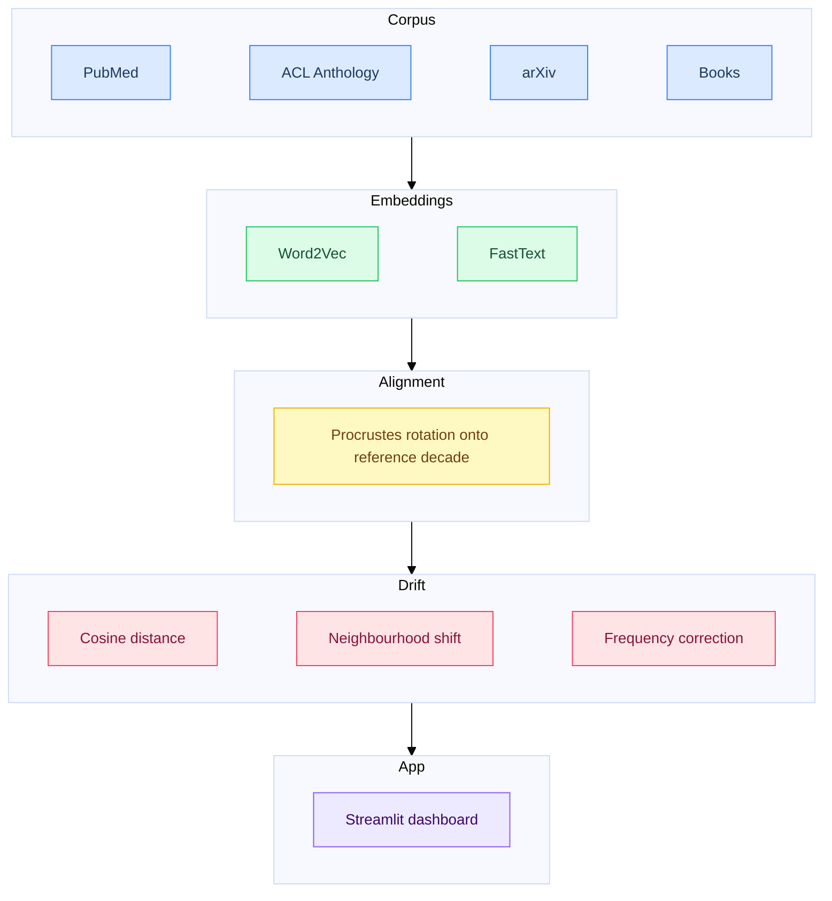

# interpretant

`interpretant` tracks how the meaning of scientific and philosophical concepts shifts across decades of academic literature. Given a word like *consciousness* or *intelligence*, it produces a trajectory through semantic space from the 1960s to the 2020s — showing which concepts surrounded it in each decade, how far it moved, and when the movement was sharpest. The corpus spans biomedical literature (PubMed), computational linguistics (ACL Anthology), and preprint science (arXiv), with optional support for book-length texts extracted from PDF.

The name comes from Peirce. In Peirce's theory of signs, the *interpretant* is neither the word nor the thing it points to — it's the meaning the sign produces in a community of minds. Not the interpreter, but the effect: the further sign, the mental response, the understanding that arises when a community encounters a representation. Peirce's key insight was that the interpretant is not fixed. It shifts as communities change, as contexts evolve, as new fields absorb old vocabularies and bend them toward new purposes. The word "intelligence" in a 1965 philosophy paper and a 2005 machine learning paper share a signifier and possibly a referent, but they carry different interpretants — different networks of association, implication, and use that have accumulated around the same sign in different communities over forty years.

This project measures that drift. `interpretant` trains word embeddings per decade on scientific and philosophical literature, aligns them into a shared vector space, and computes how far a word has moved — which concepts it has grown closer to, which it has left behind, and when the movement was sharpest.

---

## Getting started

```bash
# Install dependencies
uv sync

# Download a corpus source
uv run interpretant corpus download acl
uv run interpretant corpus download pubmed   # large; see corpus section below

# Preprocess into decade-sliced text files
uv run interpretant corpus preprocess --config-name acl --start 1970 --end 2020
uv run interpretant corpus preprocess --config-name pubmed --start 1970 --end 2020 --workers 8

# Train embeddings
uv run interpretant embed train --corpus acl --corpus pubmed --start 1970 --end 2020

# Align and measure
uv run interpretant align run
uv run interpretant drift compute --words consciousness intelligence representation emergence

# Launch the dashboard
uv run interpretant app
```

To run the demo without any corpus data:

```bash
make app-demo
```

---

## How it works

1. **Corpus** — raw text from PubMed, ACL Anthology, arXiv, and optionally books is preprocessed into decade-sliced token files.
2. **Embeddings** — a Word2Vec or FastText model is trained per decade on the merged corpus, producing one vector space per ten-year window.
3. **Alignment** — each decade's space is rotated onto a shared reference decade via orthogonal Procrustes, making vectors directly comparable across time.
4. **Drift** — for each tracked word: cosine distance between decade vectors, nearest-neighbour shift (Jaccard distance on the top-25 neighbours), and frequency-corrected drift to suppress noise from rare terms.
5. **Dashboard** — trajectories, drift timelines, and nearest-neighbour evolution visualised interactively in Streamlit.



All stages are wired into a DVC pipeline (`dvc.yaml`) for reproducible reruns.

---

## The corpus

The current corpus draws from three sources:

**PubMed** (NCBI baseline, ~7M articles after language filtering): biomedical literature from the 1970s to 2020s. English-only, structured abstract labels stripped. The largest source by volume and the one most likely to show clean decade-level shifts in vocabulary as subfields emerged and matured.

**ACL Anthology** (~90K papers, 1965–2023): the full proceedings of computational linguistics and NLP conferences. Dense in technical vocabulary; useful for tracking how language about language changed as the field moved from rule-based to statistical to neural methods.

**arXiv** (Kaggle snapshot, ~78K papers filtered): preprints in quantitative and computational fields from 1991 onward. Earlier and less curated than the others; useful for tracking interdisciplinary vocabulary diffusion.

**Books** (optional): PDF-extracted text from canonical works in philosophy of mind, AI, design, and cultural theory. Ingested via Docling with fallback to PyMuPDF. Treated as a separate corpus layer that can be included or excluded from training.

The fields are chosen because they share vocabulary under different interpretive frameworks. Philosophy, cognitive science, AI, and design all use words like *representation*, *emergence*, *complexity*, *embodiment*, and *intelligence* — but the communities are distinct enough that the semantic distance between their uses is measurable.

---

## Stack

| Tool | Role |
|------|------|
| `uv` | Package management and environments |
| `Click` | CLI |
| `Hydra` / `OmegaConf` | Hierarchical configuration |
| `DVC` | Pipeline DAGs and data versioning |
| `gensim` | Word2Vec and FastText training |
| `scipy` | Procrustes alignment |
| `scikit-learn` | PCA for trajectory visualisation |
| `Streamlit` / `Plotly` | Dashboard |
| `Docling` / `PyMuPDF` | PDF extraction for books corpus |
| `Ruff` | Linting and formatting |
| `pytest` | Tests (synthetic fixtures, no real NLP in test suite) |
| `mypy` (strict) | Type checking |

**On alignment:** The current implementation uses Procrustes rotation — each decade's embedding space is independently trained and post-hoc aligned to a reference decade via an orthogonal transformation. This is standard and produces reasonable results but accumulates alignment error across many decades. The planned replacement is TWEC (Training With a Compass), which shares a compass embedding across all time slices during training and requires no post-hoc alignment. TWEC requires a custom gensim fork and is currently stubbed.

**On embeddings:** Word2Vec and FastText are both implemented and selectable at training time. FastText's subword model produces meaningful vectors for rare and hyphenated technical terms that Word2Vec would skip or represent poorly — relevant for a corpus that includes philosophy and humanities, where terminology is often low-frequency.

---

## Theoretical background

The distributional hypothesis underlying Word2Vec — "a word is known by the company it keeps" (Firth, 1957) — is a computational operationalization of Wittgenstein's claim that meaning is use. A word vector encodes not what a word *is* but how it *behaves* in relation to other words across a corpus. In Peircean terms, it is a snapshot of the **dynamic interpretant**: the aggregate effect a sign produces in a specific community over a specific period.

This means the vectors are social facts, not semantic facts. They capture what a community did with a sign — which words it appeared near, which arguments it enabled, which conceptual neighbours it acquired. The drift score between two decades is a measurement of how much the collective interpretant moved, not necessarily how much the underlying phenomenon changed or how much the referent shifted. These are different questions.

Unlimited semiosis — Peirce's observation that the interpretant of a sign is itself a sign, which produces a further interpretant, indefinitely — is visible in the data as the expansion and contraction of semantic neighborhoods. A term absorbs new associations, sheds old ones, gets borrowed by adjacent fields who use it in their own sign relations. The process doesn't converge. The pipeline makes individual moments in that process legible and comparable.

---

## Limitations

**Embeddings capture the interpretant, not the full Peircean triad.** There is no object in the model — no connection between the word vector and whatever the word refers to in the world. The project measures drift of the collective interpretant, not drift of reference or truth. Two words can have converging vectors because a community started using them interchangeably, or because they were genuinely tracking the same phenomenon from different angles, and the embeddings cannot distinguish between these.

**Frequency effects.** Rare words appear volatile in drift metrics even when the change is noise rather than signal. Frequency-corrected drift mitigates this but doesn't eliminate it. Low-frequency terms in early decades should be interpreted cautiously.

**The corpus is not the discourse.** PubMed, ACL, and arXiv capture published academic papers. The interpretants measured here are the interpretants of academic communities — which is the intended scope, but not all of discourse, and not all of intellectual history. Books add depth for key texts but don't solve the general sampling problem.

**Decade granularity is coarse.** Training on ten-year windows smooths over within-decade shifts and may misattribute the timing of changes that happened rapidly at decade boundaries. The changepoint detection module (currently stubbed) is intended to address this.

**TWEC is not yet running.** The current Procrustes alignment is post-hoc and accumulates rotation error across many decades. This is a known limitation of the current implementation.

---

## Roadmap

- [ ] Complete PubMed corpus gap (2000s files downloading)
- [ ] Run full pipeline on merged corpus; validate vocabulary sizes and drift metrics
- [ ] Test dashboard on real data; implement drift heatmap panel
- [ ] Implement TWEC alignment (requires custom gensim fork)
- [ ] Implement changepoint detection (PELT or BOCPD) for decade-level breakpoints
- [ ] Books corpus: ingest canonical texts per field and decade
- [ ] Replace illustrative findings with real ones
- [ ] Add corpus selector to dashboard (per-source vs merged drift)

---

## License

MIT
