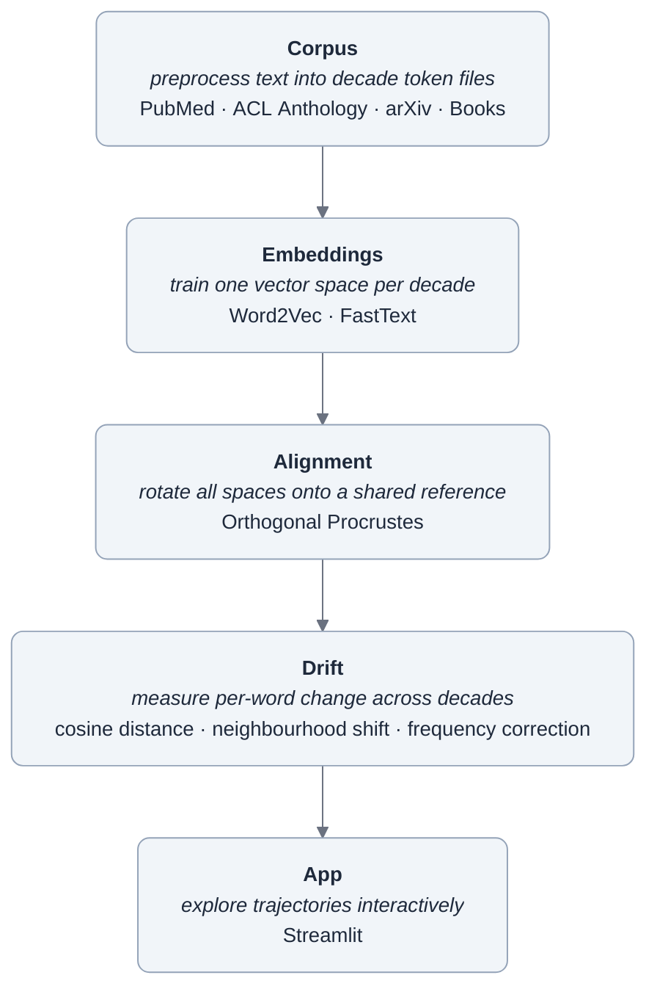

# interpretant

`interpretant` tracks how the meaning of scientific and philosophical concepts shifts across decades of academic literature. Given a word like _consciousness_ or _intelligence_, it produces a trajectory through semantic space from the 1970s to the 2020s — showing which concepts surrounded it in each decade, how far it moved, and when the movement was sharpest. The corpus spans biomedical literature (PubMed), computational linguistics (ACL Anthology), preprint science (arXiv), and canonical book-length texts in philosophy of mind, AI, design, and cultural theory — extracted from PDF and treated as a first-class corpus layer alongside the paper sources.

The name comes from Peirce. In Peirce's theory of signs, the _interpretant_ is neither the word nor the thing it points to — it's the meaning the sign produces in a community of minds. Not the interpreter, but the effect: the further sign, the mental response, the understanding that arises when a community encounters a representation. Peirce's key insight was that the interpretant is not fixed. It shifts as communities change, as contexts evolve, as new fields absorb old vocabularies and bend them toward new purposes. The word "intelligence" in a 1965 philosophy paper and a 2005 machine learning paper share a signifier and possibly a dynamic object, but they carry different interpretants — different networks of association, implication, and use that have accumulated around the same sign in different communities over forty years.

This project measures that drift.

---

## Motivation

Concepts migrate. "Network" meant something different to a neurologist in 1975 than to a computational biologist in 2005 or a social scientist in 2015. "Intelligence" has been borrowed, bent, and contested across philosophy, psychology, and computer science for sixty years. The word stays the same; the community using it changes what it does with the word.

Historians and philosophers of science have documented this carefully — but almost always through close reading of individual texts. The question this project asks is whether conceptual migration is _measurable at scale_: not what a handful of canonical papers say about _consciousness_, but what 7 million biomedical abstracts, 120,000 NLP papers, and decades of canonical texts in philosophy and design collectively did with it, decade by decade. And not just whether it drifted — but whether it drifted the same way across fields, and what any divergence reveals about the communities.

That question is where the method becomes an instrument for intellectual history rather than text statistics.

---

## The corpus

Philosophy, cognitive science, AI, and biomedicine all use words like _representation_, _emergence_, and _intelligence_ — but their communities are distinct enough that the distance between their uses is measurable. The corpus draws from four sources chosen to make that comparison possible:

**PubMed** (~7M articles after English-language and date filtering from the NCBI baseline): biomedical literature from the 1970s to 2020s. Structured abstract labels stripped. The largest source by volume and the one most likely to show clean decade-level shifts as subfields emerged and matured.

**ACL Anthology** (~120K papers as of 2025, 1965–present): the full proceedings of computational linguistics and NLP conferences. Dense in technical vocabulary; useful for tracking how language about language changed as the field moved from rule-based to statistical to neural methods. The corpus snapshot used here reflects the state of the anthology at download time.

**arXiv** (Kaggle snapshot, ~78K papers filtered): preprints in quantitative and computational fields from 1991 onward. Earlier and less curated than the others; useful for tracking interdisciplinary vocabulary diffusion.

**Books**: PDF-extracted text from canonical works in philosophy of mind, AI, design, and cultural theory — the primary source for humanistic and philosophical vocabulary that the paper corpora don't cover. Ingested via Docling with fallback to PyMuPDF. The books layer covers thinkers including Ryle, Wittgenstein, Merleau-Ponty, Dennett, Chalmers, Damasio (neuroscientist), Varela, Minsky, Dreyfus, Norman, Flusser, McLuhan, Barthes, Baudrillard, and Fisher, among others — spanning from the 1940s to the 2000s. This is what makes cross-field comparison between scientific and humanistic discourse possible.

---

## How it works



All stages are wired into a DVC pipeline (`dvc.yaml`) for reproducible reruns.

The distributional hypothesis underlying Word2Vec — "You shall know a word by the company it keeps" (Firth, 1957) — converges with Wittgenstein's observation that, for a large class of cases, meaning is use. A word vector encodes not what a word _is_ but how it _behaves_ in relation to other words across a corpus. Peirce distinguishes three registers of the interpretant:

1. **Immediate** — what a sign is interpretable as, prior to any specific context
2. **Dynamic** — the actual effect it produces on a mind at a given moment
3. **Final** — the ideal effect that would be reached at the convergent end of unlimited inquiry

A decade-trained word vector corresponds to none of these directly — but corpus statistics across a community and a period capture the aggregate of dynamic interpretant events, and that aggregate is what the pipeline measures. The vectors are social facts, not semantic facts: they capture what a community did with a sign — which words it appeared near, which arguments it enabled, which conceptual neighbours it acquired.

Decade models are trained independently and have no shared coordinate system by default. Procrustes alignment finds the optimal orthogonal transformation (rotation, with reflections excluded) mapping each decade onto a shared reference, making cross-decade distances meaningful. The planned replacement is TWEC (_Training Temporal Word Embeddings with a Compass_, Di Carlo et al. 2019), which uses atemporal reference vectors to constrain training of time-slice embeddings, largely eliminating the need for post-hoc alignment.

_Interpretant drift_ is the more precise description of what the pipeline measures. The standard framing of semantic drift is descriptive and atheoretical: the word moved. It doesn't specify what's actually changing — the word, the community, or the relationship between them. Interpretant drift treats meaning as a property of a community's relationship to signs: the community changed what it did with the sign, and the vector displacement encodes that change. "Consciousness" didn't drift. Philosophers stopped reading Husserl and started reading Crick. The word is the trace; the community is the event. The stronger claim is also why the interpretant of _intelligence_ in philosophy and the interpretant of _intelligence_ in computer science are not two measurements of the same thing — they are two different things, and separating fields in the corpus is theoretically motivated, not just methodologically conservative.

Infinite semiosis — Peirce's observation that the interpretant of a sign is itself a sign, which produces a further interpretant, indefinitely (called "unlimited semiosis" by Eco, who developed the concept at length) — offers a theoretical frame for what the pipeline makes legible: a term absorbs new associations, sheds old ones, gets borrowed by adjacent fields who use it in their own sign relations. Each decade vector is a moment in a process that has no principled end.

---

## What we expect to find

If the method is sound and the Peircean framing holds, the data should show:

- **Field-specific trajectories for shared vocabulary.** Words like _consciousness_, _representation_, and _emergence_ should show meaningfully different drift patterns in PubMed vs the books corpus vs ACL — not because the word changed, but because the communities diverged. The divergence itself is the finding.

- **Legible historical inflection points.** The shift from symbolic to statistical AI, the rise of cognitive neuroscience in the 1990s, the neural turn in NLP in the 2010s — these are well-documented events in intellectual history. They should be visible as sharp decade-level movements in the relevant vocabulary.

- **Asymmetric borrowing.** When a term migrates from one field to another — _network_ from neuroscience into computational biology, _emergence_ from complexity theory into philosophy of mind — the borrowing field's neighbourhood should show faster drift and denser assimilation of the source field's vocabulary.

- **Convergence where expected, divergence where interesting.** Some terms will have converged across fields over time as disciplines developed shared vocabulary. Others — _intelligence_, _representation_, _consciousness_ — should remain divergent or show divergence accelerating. The pattern of convergence and divergence is the intellectual history the pipeline is designed to surface.

---

## Findings

*Pipeline results forthcoming. The corpus is complete; training and analysis are in progress.*

---

## Getting started

```bash
# Install dependencies
uv sync

# Download paper corpus sources
uv run interpretant corpus download acl
uv run interpretant corpus download pubmed   # ~27 MB/file; 100 files ≈ 2.7 GB, ~30 min

# Ingest book-length texts (place PDFs in data/inbox/pdfs/ first)
uv run interpretant corpus books ingest

# Preprocess all sources into decade-sliced text files — one .txt per decade per corpus
uv run interpretant corpus preprocess --config-name acl --start 1970 --end 2020
uv run interpretant corpus preprocess --config-name pubmed --start 1970 --end 2020 --workers 8
uv run interpretant corpus preprocess --config-name books --start 1960 --end 2020

# Train one Word2Vec model per decade from the merged corpus
uv run interpretant embed train --corpus acl --corpus pubmed --corpus books --start 1970 --end 2020

# Rotate all decade models into a shared vector space, then compute drift
uv run interpretant align run
uv run interpretant drift compute --words consciousness intelligence representation emergence

# Launch the dashboard
uv run interpretant app
```

To explore the interface without any corpus data, `make app-demo` runs the dashboard on synthetic vectors — useful for checking the UI before training is complete.

---

## Stack

| Tool                   | Role                                                  |
| ---------------------- | ----------------------------------------------------- |
| `uv`                   | Package management and environments                   |
| `Click`                | CLI                                                   |
| `Hydra` / `OmegaConf`  | Hierarchical configuration                            |
| `DVC`                  | Pipeline DAGs and data versioning                     |
| `gensim`               | Word2Vec and FastText training                        |
| `scipy`                | Procrustes alignment                                  |
| `scikit-learn`         | PCA for trajectory visualisation                      |
| `Streamlit` / `Plotly` | Dashboard                                             |
| `Docling` / `PyMuPDF`  | PDF extraction for books corpus                       |
| `Ruff`                 | Linting and formatting                                |
| `pytest`               | Tests (synthetic fixtures, no real NLP in test suite) |
| `mypy` (strict)        | Type checking                                         |

---

## Limitations

**Embeddings capture the interpretant, not the full Peircean triad.** There is no object in the model — no connection between the word vector and whatever the word refers to in the world. The project measures drift of the collective interpretant, not drift of reference or truth. Two words can have converging vectors because a community started using them interchangeably, or because they were genuinely tracking the same phenomenon from different angles, and the embeddings cannot distinguish between these.

**Frequency effects.** Rare words appear volatile in drift metrics even when the change is noise rather than signal. Frequency-corrected drift mitigates this but doesn't eliminate it. Low-frequency terms in early decades should be interpreted cautiously.

**The corpus is not the discourse.** PubMed, ACL, and arXiv capture published academic papers. The interpretants measured here are the interpretants of academic communities — which is the intended scope, but not all of discourse, and not all of intellectual history. Books add depth for key texts but don't solve the general sampling problem.

**Decade granularity is coarse.** Training on ten-year windows smooths over within-decade shifts and may misattribute the timing of changes that happened rapidly at decade boundaries. The changepoint detection module (currently stubbed) is intended to address this.

**Procrustes alignment accumulates error.** The current alignment maps each decade independently onto a fixed reference decade. Each decade carries its own independent rotation error. TWEC is the planned replacement.

---

## Roadmap

- [ ] Complete PubMed corpus gap (2000s files downloading)
- [ ] Run full pipeline on merged corpus; validate vocabulary sizes and drift metrics
- [ ] Test dashboard on real data; implement drift heatmap panel
- [ ] Implement TWEC alignment (requires custom gensim fork)
- [ ] Implement changepoint detection (PELT or BOCPD) for decade-level breakpoints
- [ ] Books corpus: complete ingestion of all planned titles across fields and decades
- [ ] Replace illustrative findings with real ones
- [ ] Add corpus selector to dashboard (per-source vs merged drift)

---

## License

MIT
